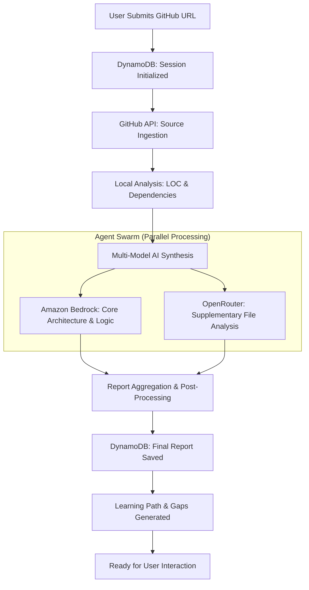

# RepoIQ: AI-Powered Repository Intelligence & Learning System

RepoIQ is an advanced AI architecture designed to help developers who "vibe-code" (use AI heavily) bridge the gap between generating code and truly understanding it. It transforms a GitHub repository into a personalized curriculum by analyzing architecture, security, and complex logic using a high-performance AWS-backed infrastructure.

---

## 🏗️ Overall Backend Process (A to Z)

The life cycle of a RepoIQ analysis session follows a sophisticated multi-stage pipeline:

### 1. Ingestion & Pre-processing
When a URL is submitted, RepoIQ uses the **GitHub Trees API** to recursively discover every file in the repository in a single network call. It filters out non-code assets (images, binaries, `node_modules`) and prioritizes critical configuration files (`package.json`, `tsconfig.json`) for the AI.

### 2. The "Agent Swarm" Analysis
To handle large repositories within token limits, RepoIQ employs a parallel processing strategy:
*   **Primary Brain (Amazon Bedrock):** Analyzes the "Priority Files" (entry points, core logic, architecture drivers) to build the main report.
*   **Secondary Swarm (OpenRouter):** Simultaneously analyzes "Tail Files" (utility functions, secondary components) to find hidden bugs and security leaks that might be missed by the primary model.

### 3. Socratic Learning Engine
Unlike basic code summaries, RepoIQ identifies **"Learning Gaps"**. It detects concepts that are complex enough that a student might have simply copied them without understanding (e.g., Higher-Order Components, Middleware, or Custom Hooks). It then generates a **Socratic follow-up question** for each gap.

---

## ☁️ AWS Infrastructure & Tools

RepoIQ is built on a "Serverless-First" architecture using **AWS Amplify (Gen 2)** for maximum scalability and low latency.

### 1. Amazon Bedrock (The Brain)
*   **Models:** Primarily uses **Amazon Nova Pro** and **Claude 3.5 Sonnet**.
*   **Role:** Performs deep semantic analysis of code. It doesn't just "see" the text; it understands the *intent* and *flow* of the application.
*   **Fallback Logic:** Implements a multi-tier fallback (Nova Pro → Nova Lite → Nova Micro) to ensure 100% availability even during AWS regional spikes.

### 2. Amazon DynamoDB (The State Machine)
*   **Tables:** `RepoIQ_Sessions`, `RepoIQ_Users`, `RepoIQ_Gaps`, `RepoIQ_Messages`, `RepoIQ_Analytics`.
*   **Role:** Acts as the persistent "Long Term Memory" for the application. It stores session states (Ingesting → Indexing → Analyzing → Complete), user learning data, and chat history.

### 3. Amazon S3 (Binary & Large Document Storage)
*   **Role:** Stores cached versions of repository files and large analysis artifacts that exceed the 400KB DynamoDB item limit. This enables the **Interactive Code Viewer** to load files instantly without re-fetching from GitHub.

### 4. AWS Lambda / Next.js API (The Orchestrator)
*   **Role:** All backend logic is executed in stateless serverless environments. This handles the orchestration between the GitHub API, LLMs, and the database.

---

## 🛠️ Advanced Core Modules

| Module | Tooling | Deep Insight |
| :--- | :--- | :--- |
| **Repo Scraper** | GitHub Trees API + Raw Content API | Uses batched parallel downloads (15 at a time) to fetch hundreds of files in seconds. |
| **Logic Synthesizer** | Bedrock Runtime SDK | Builds a prompt context by ranking files by "Dependency Importance" rather than just size. |
| **Security Scanner** | AI Security Heuristics | Scans for OWASP Top 10, hardcoded secrets, and data exposure within the actual code logic. |
| **Code Quality Engine** | Custom Parser + LLM | Estimates maintainability, readability, and test coverage based on architectural patterns. |

---

## 🧭 Learning Map Logic

The final output is a structured **Learning Map** containing:
1.  **Architecture Graph:** How the pieces fit together.
2.  **Complexity Hotspots:** The top 3-5 most complex functions that need study.
3.  **Step-by-Step Lessons:** A personalized curriculum from Beginner to Advanced focused *only* on the current codebase.
4.  **Runtime Requirements:** Data-driven estimates for RAM and environment setup needed to run the project.

---

> **Design Philisophy:** RepoIQ operates on the principle of **"Vibe-to-Code Mastery"**. It assumes the code works, but the human needs to catch up. By leveraging high-density AWS AI infrastructure, it bridges this gap in under 60 seconds.
